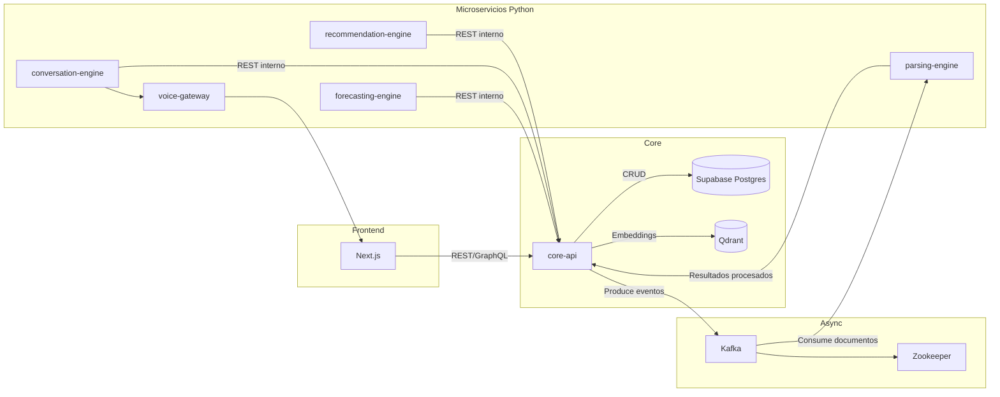

# Arquitectura de `docker-compose`

Este documento resume la topología declarada en [`docker-compose.yml`](../../docker-compose.yml) y destaca los parámetros críticos para ejecución local y despliegues productivos.

## Servicios

| Servicio | Imagen / Build | Puertos expuestos | Dependencias | Healthcheck | Rol principal |
|----------|----------------|-------------------|--------------|-------------|---------------|
| `qdrant` | `qdrant/qdrant:latest` | `6333`, `6334` | — | `curl http://localhost:6333/health` | Base de datos vectorial para embeddings y búsquedas semánticas. |
| `core-api` | Build `./services/core-api` | `3000->8080` | Supabase (externo), `qdrant` (started) | `curl http://localhost:3000/api/health` | API Node.js central: orquesta autenticación, ingesta de documentos y coordinación con microservicios. |
| `frontend` | Build `./frontend` (`npm run dev`) | `3001->3000` | — | `wget http://localhost:3000` | Aplicación Next.js para experiencia web; consume `core-api`, `conversation-engine` y `voice-gateway`. |
| `parsing-engine` | Build `./services/parsing-engine` | — | `kafka`, `core-api` | — | Microservicio Python que procesa documentos publicados en Kafka y guarda resultados compartiendo volumen `/uploads`. |
| `recommendation-engine` | Build `./services/recommendation-engine` | `8001->8000` | — | `curl http://localhost:8000/health` | API FastAPI que entrega recomendaciones financieras al `core-api`. |
| `financial-connector` | Build `./services/financial-connector` | `8004->8000` | `core-api` (started) | `curl http://localhost:8000/health` | Conector FastAPI que orquesta sincronizaciones bancarias y cargas de archivos hacia Belvo. |
| `conversation-engine` | Build `./services/conversation-engine` | `8002` | `core-api` (started) | `curl http://localhost:8002/health` | Motor conversacional que se comunica con `core-api` para obtener contexto vía `CORE_API_BASE_URL`. |
| `forecasting-engine` | Build `./services/forecasting-engine` | `8003` | Supabase (externo) | `curl http://localhost:8003/health` | Servicio de pronósticos que lee/escribe en la base de datos gestionada vía `FORECASTING_DATABASE_URL`. |
| `voice-gateway` | Build `./services/voice-gateway` | `8100` | `conversation-engine` | `curl http://localhost:8100/health` | Pasarela de voz que encapsula STT/TTS y delega lógica conversacional al `conversation-engine`. |
| `zookeeper` | `confluentinc/cp-zookeeper:7.3.2` | — | — | — | Servicio de coordinación requerido por Kafka. |
| `kafka` | `confluentinc/cp-kafka:7.3.2` | `9092`, `29092` | `zookeeper` | `cub kafka-ready` | Bus de eventos para los motores Python y `core-api` (publicación/consumo de documentos y eventos asíncronos). |

### Notas de dependencia

- `parsing-engine` necesita acceso al volumen `uploads_volume` para intercambiar archivos con `core-api`.
- `financial-connector` expone los endpoints usados por las pantallas de cuentas, transacciones y dashboard para disparar sincronizaciones y cargas desde Belvo.
- Los microservicios Python se conectan a Kafka (`kafka:9092`) para suscribirse a tópicos definidos en las variables de entorno.
- `forecasting-engine` y `core-api` dependen de la base de datos administrada en Supabase; `core-api` también inicializa colecciones en Qdrant.

## Redes y volúmenes

| Recurso | Tipo | Propósito |
|---------|------|-----------|
| `salomon-net` | Red bridge (local) / overlay (producción) | Aisla el tráfico interno entre API, microservicios y bases de datos. |
| `qdrant_data` | Volumen | Almacena vectores de Qdrant. |
| `uploads_volume` | Volumen | Zona compartida entre `core-api` y `parsing-engine` para documentos subidos. |
| `models_volume` | Volumen | Contiene modelos de NLP utilizados por servicios Python. |
| `prometheus_data` | Volumen (solo `docker-compose.prod.yml`) | Persistencia de métricas en Prometheus. |
| `grafana_data` | Volumen (solo `docker-compose.prod.yml`) | Persistencia de dashboards de Grafana. |

## Variables de entorno críticas

Las variables provienen de [`docker-compose.yml`](../../docker-compose.yml), [`docker-compose.prod.yml`](../../docker-compose.prod.yml) y el archivo de referencia [`./.env.example`](../../.env.example).

### Núcleo y coordinación

- `CORE_API_BASE_URL` (usada por `conversation-engine`): URL interna de la API principal; debe resolverse en la red Docker. Ejemplo: `http://core-api:8080`.
- `INTERNAL_API_KEY`, `API_KEY_SECRET`: claves que controlan invocaciones internas y emisión de API Keys.
- `JWT_SECRET`, `JWT_SECRET_FILE` (producción): tokenización y autenticación en `core-api`.
- `INTERNAL_API_KEY_FILE` (producción): provee la API key interna desde secretos montados.

### Bases de datos y almacenamiento

- `POSTGRES_*`: host, puerto, base y credenciales del clúster Supabase. La cadena resultante debe incluir `?sslmode=require` y se reutiliza en `FORECASTING_DATABASE_URL`.
- `QDRANT_URL`, `QDRANT_COLLECTION_NAME`: configuración del vector store utilizado por recomendadores y análisis semántico.
- `UPLOAD_PATH`, `MAX_FILE_SIZE`, `ALLOWED_FILE_TYPES`: restringen almacenamiento de archivos y validaciones en `core-api`.

### Mensajería y procesamiento asíncrono

- `KAFKA_BROKER`, `KAFKA_BROKERS`, `KAFKA_TOPIC`, `KAFKA_CLIENT_ID`, `KAFKA_GROUP_ID`: coordinan la comunicación entre `core-api`, `parsing-engine` y demás motores.
- `KAFKA_ADVERTISED_LISTENERS`, `KAFKA_LISTENER_SECURITY_PROTOCOL_MAP`: definen endpoints accesibles dentro y fuera del clúster.

### Frontend y experiencia de usuario

- `NEXT_PUBLIC_API_URL`, `NEXT_PUBLIC_CONVERSATION_ENGINE_URL`, `NEXT_PUBLIC_VOICE_GATEWAY_URL`: URLs públicas para que el frontend acceda a servicios internos.
- `ALLOWED_ORIGINS`: lista separada por comas con los dominios autorizados para `core-api` (localhost, dominio en Vercel `https://prueba-salomon.vercel.app` y dominio personalizado).

### Motores especializados

- `FORECASTING_DEFAULT_MODEL`, `FORECASTING_DEFAULT_HORIZON_DAYS`: parámetros por defecto de pronósticos.
- `VOICE_STT_PROVIDER`, `VOICE_TTS_PROVIDER`: selección de proveedores de voz en la pasarela.
- `NLP_MODEL_PATH`, `NLP_LANGUAGE`, `NLP_CONFIDENCE_THRESHOLD`: controlan procesamiento NLP.

### Observabilidad y rendimiento

- `LOG_LEVEL`, `METRICS_ENABLED`, `HEALTH_CHECK_INTERVAL`: ajustan logging y métricas.
- En producción, Prometheus y Grafana añaden volúmenes dedicados y requieren mapeo de puertos (`9090`, `3003`).

## Flujos entre componentes



### Tabla de interacción con Kafka y bases de datos

| Componente | Interacciones con Kafka | Persistencia principal |
|------------|------------------------|------------------------|
| `core-api` | Publica eventos de documentos y escucha respuestas | Supabase (externo), Qdrant (`qdrant_data`) |
| `parsing-engine` | Consume tópicos `documents.pending_processing` y publica resultados | Volumen `uploads_volume` para archivos procesados |
| `recommendation-engine` | Puede consumir eventos para actualizar recomendaciones (opcional) | Qdrant para embeddings, variables en memoria |
| `forecasting-engine` | Puede dispararse vía API o eventos para cálculos batch | Supabase (mediante `FORECASTING_DATABASE_URL`) |
| `conversation-engine` | Consulta estado vía API, publica/consume mensajes de usuario | Supabase (para historial a través de `core-api`) |
| `voice-gateway` | Intermediario entre conversaciones y usuarios; puede publicar eventos de interacción | No persiste datos, depende de `conversation-engine` |

## Puesta en marcha local

1. **Pre-requisitos**: Docker Desktop/Engine 20+, Docker Compose v2, archivo `.env` basado en `.env.example` con credenciales válidas.
   - Si trabajas con Supabase, verifica que las URLs incluyan `?sslmode=require`.
2. **Inicializar volúmenes y dependencias** (opcional, reinicia estado):
   ```bash
   docker compose down -v
   ```
3. **Arrancar todo el stack**:
   ```bash
   docker compose up --build
   ```
4. **Verificar salud**:
   - `http://localhost:3000/api/health` (`core-api`)
   - `http://localhost:3001` (frontend)
   - `http://localhost:8002/health` (`conversation-engine`)
   - `http://localhost:9090` (Prometheus si usas `docker-compose.prod.yml` en modo local)
5. **Logs**: usar `docker compose logs -f <servicio>` para depurar motores específicos.

### Consideraciones locales

- `frontend` monta el código fuente con `bind mount`, por lo que los cambios se reflejan en caliente.
- Usa Supabase como origen de datos principal; asegúrate de que `.env` apunte al host gestionado y que las cadenas incluyan `?sslmode=require`.
- `parsing-engine` requiere modelos en `models_volume`; asegúrate de poblar `/models` si tus pipelines lo necesitan.
- Si conectas clientes externos a Kafka, usa `localhost:29092` tal como está anunciado en `KAFKA_ADVERTISED_LISTENERS`.

## Recomendaciones para entornos productivos

- Utiliza [`docker-compose.prod.yml`](../../docker-compose.prod.yml) para construir imágenes versionadas y habilitar escalado (`replicas`) en `core-api` y `frontend`.
- Declara secretos (`./secrets/jwt_secret.txt`, `./secrets/internal_api_key.txt`) y monta certificados TLS para Nginx (`./nginx/certs`).
- Cambia `salomon-net` a red overlay cuando se ejecute en Swarm o Kubernetes equivalente.
- Configura almacenamiento persistente gestionado para volúmenes (`qdrant_data`, `prometheus_data`, `grafana_data`).
- Ajusta límites de recursos (`deploy.resources`) acorde a la carga esperada; actualmente `core-api` reserva 0.25 CPU / 512MB en prod.
- Implementa monitoreo centralizado activando Prometheus y Grafana, y considera alertas sobre los healthchecks definidos.
- Sincroniza variables públicas del frontend (`NEXT_PUBLIC_*`) con URLs expuestas por Nginx u otro gateway para evitar CORS y mezclar HTTP/HTTPS.

